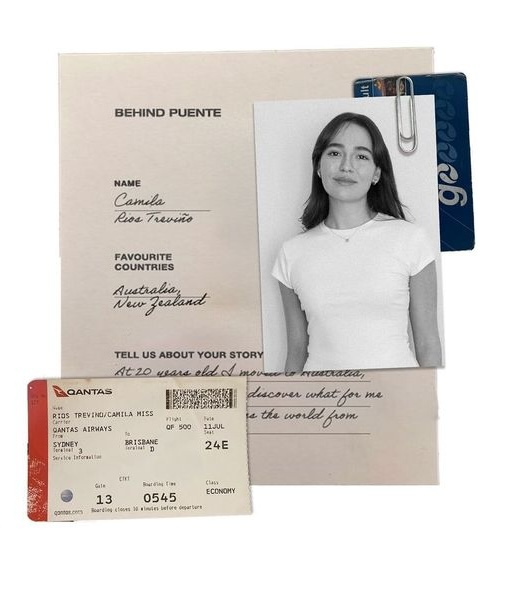

# GAMMAL ABOUT ME BACKUP

Date: 2026-02-19
Trigger phrase: "gammal about me"

## CSS BLOCK (about + statement + related styles)
```css
        .cv-button {
            display: inline-block;
            margin-top: 0;
            padding: 14px 28px;
            background-color: #e5e7eb;
            color: #000;
            text-decoration: none;
            border-radius: 999px;
            font-weight: 700;
            transition: transform 0.2s ease, background-color 0.2s ease;
        }

        .cv-button:hover {
            background-color: #d1d5db;
            transform: translateY(-2px);
        }

        .about-section,
        .education-section,
        .portfolio-section {
            max-width: 1200px;
            margin: 90px auto;
            padding: 0 24px;
        }

        .about-statement {
            max-width: 1200px;
            margin: 70px auto 0;
            padding: 0 24px;
        }

        .about-statement p {
            margin: 0;
            text-align: center;
            background: #fff;
            color: #000000;
            font-family: "Arial Black", "Impact", "Helvetica Neue", Arial, sans-serif;
            font-size: clamp(1rem, 3.5vw, 2.5rem);
            font-weight: 900;
            text-transform: uppercase;
            line-height: 0.96;
            letter-spacing: 0.5px;
            white-space: nowrap;
            padding: clamp(24px, 4vw, 44px);
        }

        .about-statement + .about-section {
            margin-top: 56px;
        }

        .about-layout {
            display: grid;
            grid-template-columns: 1fr 1.05fr;
            gap: 56px;
            align-items: center;
        }

        .about-copy h2 {
            margin: 0 0 18px;
            font-size: clamp(1.8rem, 4vw, 2.8rem);
            letter-spacing: 1px;
        }

        .about-copy p {
            margin: 0;
            font-size: 1.08rem;
            line-height: 1.75;
            color: var(--muted);
            max-width: 42ch;
        }

        .about-tags {
            display: flex;
            flex-wrap: wrap;
            gap: 10px;
            margin-top: 30px;
        }

        .about-tags.secondary {
            margin-top: 36px;
            display: grid;
            gap: 10px;
        }

        .about-tag {
            display: inline-flex;
            align-items: center;
            justify-content: center;
            border-radius: 999px;
            background: #e5e7eb;
            color: #000;
            padding: 8px 14px;
            font-size: 0.9rem;
            white-space: nowrap;
        }

        .about-tags-row {
            display: flex;
            flex-wrap: wrap;
            gap: 10px;
        }

        .about-visual {
            display: flex;
            flex-direction: column;
            align-items: center;
            gap: 1px;
        }

        .about-photo {
            width: 100%;
            max-height: 1520px;
            object-fit: cover;
            border-radius: 18px;
        }
            .about-statement {
                margin: 42px auto 0;
                padding: 0 18px;
            }

            .about-layout {
                grid-template-columns: 1fr;
                gap: 24px;
            }
```

## HTML BLOCK (statement + about section)
```html
    <section class="about-statement">
        <p>POWER GREAT BRANDS<br>WITH EVEN GREATER MARKETING</p>
    </section>

    <section class="about-section" id="about-me">
        <div class="about-layout">
            <div class="about-copy">
                <h2>ABOUT ME</h2>
                <p>Growth Marketing student driven by how data reflects real human behavior. By crafting creative strategies that drive engagement, I aim to both meet an audience’s needs while sparking a new demand. My goal is therefore to analyze what truly engages an audience and maximize those insights to ensure memorable campaigns and sustain growth</p>
                <div class="about-tags">
                    <span class="about-tag">Well structured</span>
                    <span class="about-tag">Growth focused</span>
                    <span class="about-tag">Dynamic</span>
                    <span class="about-tag">Socially engaged</span>
                    <span class="about-tag">Audience-focused but brand-centered</span>
                </div>
                <div class="about-tags secondary">
                    <div class="about-tags-row">
                        <span class="about-tag">GA4</span>
                        <span class="about-tag">GTM</span>
                        <span class="about-tag">Shopify</span>
                        <span class="about-tag">Looker Studio</span>
                    </div>
                    <div class="about-tags-row">
                        <span class="about-tag">Lucky Orange</span>
                        <span class="about-tag">Meta Ads Manager</span>
                    </div>
                </div>
            </div>
            <div class="about-visual">
                
                <a href="CV - Jasmine Ramsten.pdf" download class="cv-button">Download my CV</a>
            </div>
```
